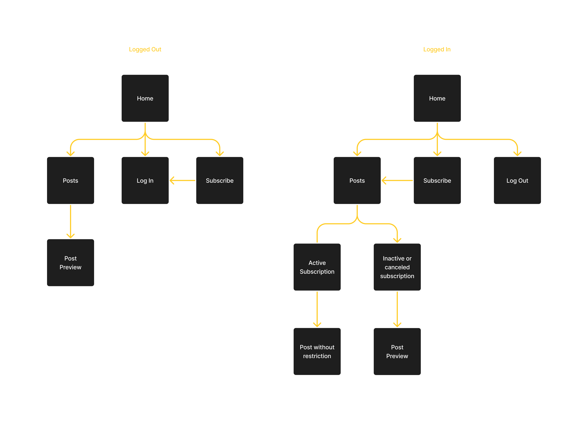

# ig.news
This app was made for study purposes, possible due to [Rocketseat](https://www.rocketseat.com.br/)'s Ignite course.

## Technologies used
- [Next.js](https://nextjs.org/) (React framework)
- [TypeScript](https://www.typescriptlang.org/)
- [React-icons](https://react-icons.github.io/react-icons/) (Icons)
- CSS Modules using SCSS
- [Stripe](https://stripe.com/) (Payment gateway)
- [FaunaDB](https://fauna.com/) (Database)
- [Prismic.io](https://prismic.io/) (Headless CMS)
- [Axios](https://axios-http.com/) (HTTP Client)
- [NextAuth.js](https://next-auth.js.org/) (Auth for Next.js)
- [Jest](https://jestjs.io/) and [Testing Library](https://testing-library.com/) (Unit test)

## User flow

## Screenshots

### Desktop
- Home page

- Posts page

- Post Preview

- Post without restriction

### Mobile
- Home page

- Posts page

- Post Preview

- Post without restriction

## Special thanks
Again I want to thank Rocketseat for the amazing course, there was a lot to learn with this project, things that surely I will use in the future, be as a personal or professional project.
